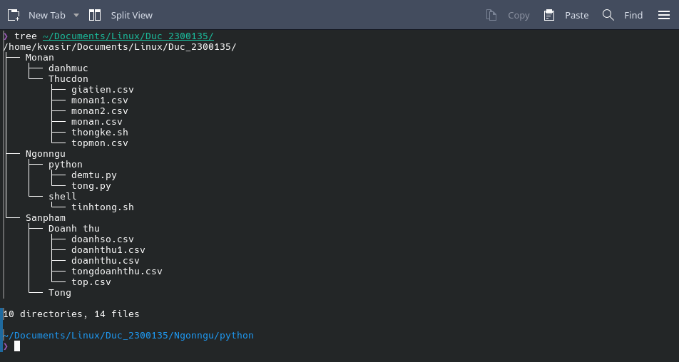
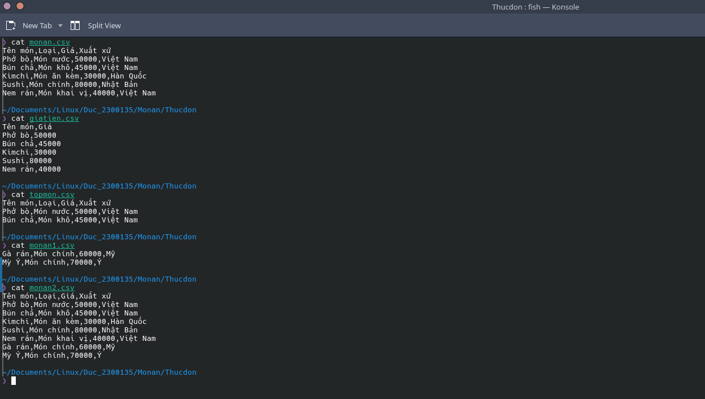
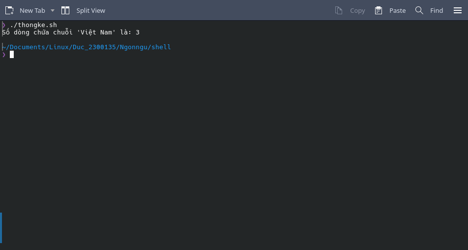
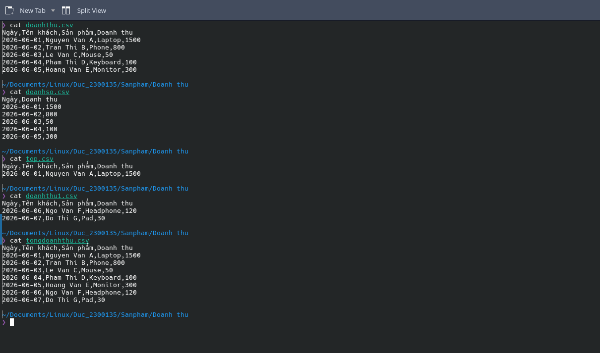
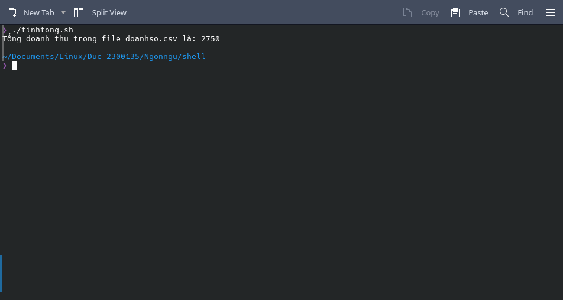
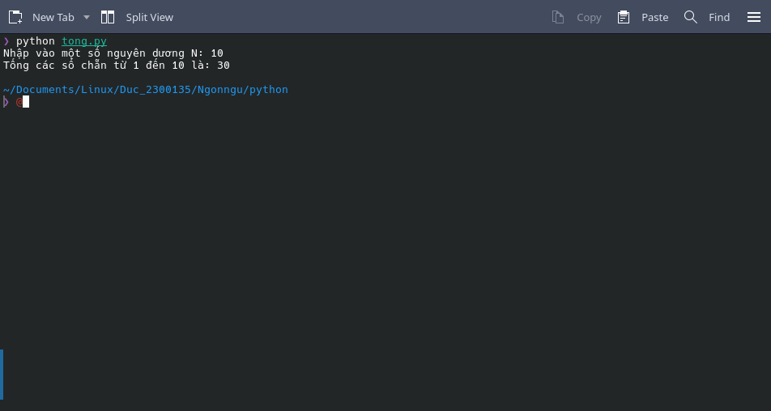
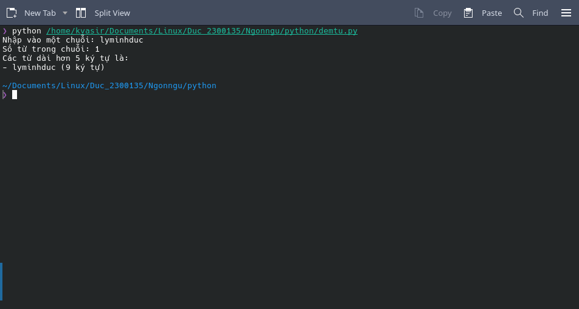

# Bài Tập Thực Hành Linux

**Sinh viên thực hiện:** Lý Minh Đức  
**Mã số sinh viên:** 2300135  

---

## 📸 Hình Ảnh Minh Họa Kết Quả

### 1. Cấu trúc cây thư mục project

### 2. Kết quả tạo dữ liệu thực đơn

### 3. Kết quả chạy Script thống kê (thongke.sh)

### 4. Kết quả tạo dữ liệu doanh thu

### 5. Kết quả chạy Script tổng doanh thu (tinhtong.sh)

### 6. Kết quả chạy chương trình Python tính tổng (tong.py)

### 7. Kết quả chạy chương trình Python đếm từ (demtu.py)

